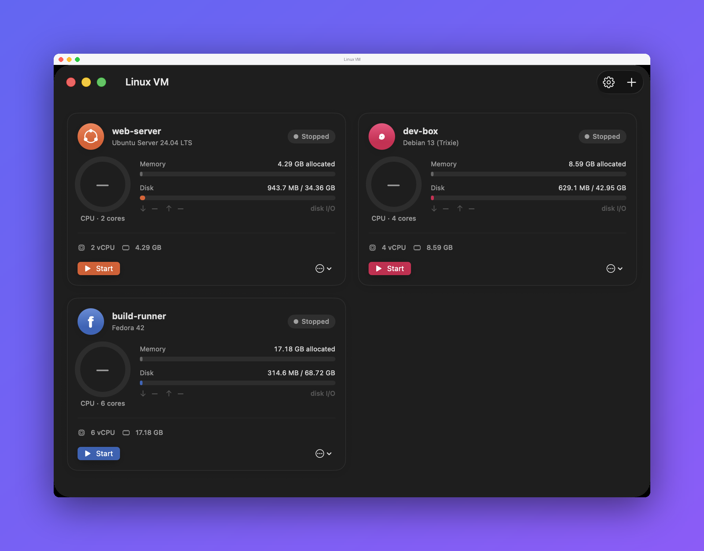

# Linux VM

Create isolated Linux VMs on Apple Silicon that install and configure themselves automatically via cloud-init.



## Download

**[⬇︎ Download for macOS](https://github.com/Alyetama/LinuxVM/releases/latest/download/LinuxVM.dmg)**

Requires an Apple Silicon Mac (M1 or later) running macOS 14+.

`https://github.com/Alyetama/LinuxVM/releases/latest/download/LinuxVM.dmg` always points at the newest release — see [Releases](https://github.com/Alyetama/LinuxVM/releases) for the changelog.

## Features

- **Zero-step provisioning** — pick a distro, set CPU/RAM/disk, and the VM installs and configures itself via cloud-init. No installer to click through.
- **Ubuntu, Debian, and Fedora** ARM64 cloud images out of the box (Debian needs no extra setup; Ubuntu/Fedora need a one-time `brew install qemu` to convert their qcow2 images).
- **Keychain-backed default login** — set your username/password once and every new VM gets it automatically.
- **Live dashboard** — real CPU, memory, disk usage and disk I/O per VM, read over SSH with a key the app manages for you.
- **Optional enhanced dev setup** — Oh My Zsh (Spaceship prompt, autosuggestions, syntax highlighting), Oh My Tmux, Docker + Compose, Miniforge, ripgrep, fd, bat, and build tools, provisioned on first boot.
- **Pick your storage location** — keep a VM's disk on an external drive instead of the default path.
- **9 built-in color themes** — Dracula, Nord, Tokyo Night, Catppuccin, Gruvbox, Solarized, One Dark, Monokai, or follow the system.
- Built entirely on Apple's **Virtualization.framework** — no Docker, no UTM, no QEMU dependency for Debian.

## First launch (opening an unsigned app)

**LinuxVM isn't signed with an Apple Developer ID**, so macOS blocks it the
first time you open it. This is expected — you only need to do one of the
following once, and it opens normally afterward.

**1. Right-click to open.** In Finder, **Control-click** (or right-click)
`LinuxVM`, choose **Open**, then click **Open** again in the dialog.

**2. If macOS still won't let you (newer versions):** open
**System Settings → Privacy & Security**, scroll down to the message about
`LinuxVM` being blocked, and click **Open Anyway**. Confirm with
**Open Anyway** (and Touch ID or your password if asked).

**3. Terminal fallback.** If neither works, remove the quarantine flag and open
it normally:

```bash
/usr/bin/xattr -dr com.apple.quarantine /Applications/LinuxVM.app
```

(Adjust the path if you keep the app somewhere other than `/Applications`.)

## Build from source

```bash
git clone https://github.com/Alyetama/LinuxVM.git
cd LinuxVM
./build.sh install   # compiles, bundles, signs, and installs to /Applications
```

Requires Xcode command-line tools / a Swift toolchain. See [build.sh](build.sh) for `run`/`install`/plain-build options.

## License

[MIT](LICENSE) © 2026 Alyetama
